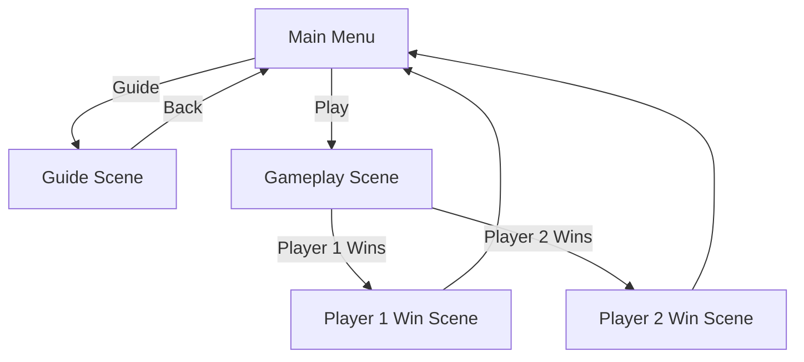

# Gravity Pong

## Project Info

Editor Version : 2021.3.xf1   

# Developer & Contributions

**Alvin Chandrawinata** — Programmer & Game Designer (2 Days)

# Introduction

Gravity Pong is a simple 2-player Pong-style game with a twist: **gravity**. Unlike classic Pong, players must jump to intercept the ball while managing limited health. The game focuses on timing, positioning, and fast reactions rather than complex mechanics.

# About

Gravity Pong is a local 2-player competitive game where:

* Player 1 and Player 2 control each characters affected by gravity
* Both players can jump to block the ball
* Each player has 3 HP
* Missing the ball causes the player to lose HP

The game features:

* Gravity based movement
* Simple jump mechanics
* Health based win condition
* Clean scene-based flow (Menu → Game → Winner)

# Gameplay

# Game Objective

### Player Objective

* Prevent the ball from entering your goal
* Reduce the opponent’s HP to zero
* Win the match by outlasting the opponent

# Scene Flow Chart

# Scripts and Features

| Script Name                   | Description                                                                                                    |
| ----------------------------- | -------------------------------------------------------------------------------------------------------------- |
| **Actual_ball**               | Controls ball initialization, random launch direction, constant speed enforcement, and gravity-based movement. |
| **PlayerJump**                | Handles jumping logic using ground detection and Rigidbody2D physics.                                          |
| **Player_movement1**          | Controls Player 1 jump input and ground detection.                                                             |
| **Player_movement2**          | Controls Player 2 jump input and ground detection.                                                             |
| **reset_on_hit**              | Detects when the ball hits a goal, reduces player HP, and resets the ball with a new direction.                |
| **game_manager**              | Manages player lives (3 HP each), updates UI icons, and handles win conditions and scene transitions.          |
| **Scores**                    | Tracks and manages both players’ scores and provides reset/debug functionality.                                |
| **Guide**                     | Handles guide window visibility and simple mouse-based guide interactions.                                     |
| **change_scene_after_second** | Automatically changes scenes after a set delay (used for winner screens or transitions).                       |

# Controls

### Player 1

| Keybind   | Action |
| --------- | ------ |
| **Space** | Jump   |

### Player 2

| Keybind   | Action |
| --------- | ------ |
| **Enter** | Jump   |

# Game Rules

* Each player starts with 3 HP
* Missing the ball removes 1 HP
* Ball resets to center after each score
* First player to lose all HP loses the game

# Possible Improvements (Recommended)

* Add horizontal movement for paddles
* Add UI for HP display
* Add sound effects for hits and scoring
* Increase ball speed over time
* Add pause menu
